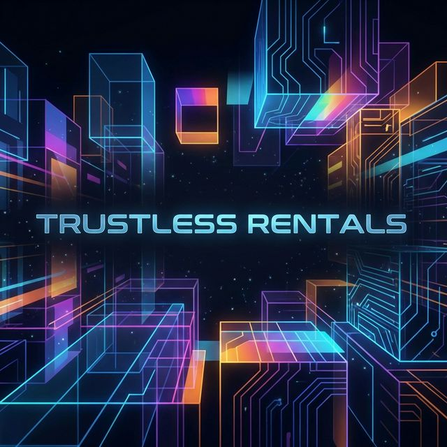

# VaultStay: Decentralized Rental & Short-Stay Escrow Protocol



**VaultStay** is a decentralized, Web3-native rental and short-stay escrow platform built on the Ethereum blockchain. It is designed to eliminate centralized financial control in property booking systems by leveraging immutable smart contracts to securely lock, manage, and release rental payments.

Unlike centralized hospitality platforms (like Airbnb or Booking.com) that act as custodial middlemen and charge exorbitant fees, VaultStay ensures that funds are governed strictly by programmatic conditions with near-zero service fees. 

---

## 🌟 Key Features

### 🔒 Trustless Escrow
Rent and security deposits are locked in the `VaultStayCore` smart contract. Funds are mathematically guaranteed to remain untouchable until both parties fulfill the agreement conditions (e.g., check-in confirmation or timeline expiration).

### ⚡ Instant, Automated Payouts
Upon the checkout date (`endDate`), the smart contract automatically permits the landlord to claim the rent and the tenant to withdraw their security deposit. No waiting 3-5 business days for bank transfers.

### 🛡️ Smart Cancellation Policies
VaultStay enforces strict, code-level cancellation logic:
- **Pre-Check-In (Early Cancel)**: The tenant can cancel prior to the check-in date for a full refund.
- **Post-Check-In (Active Cancel)**: If cancelled mid-stay, the landlord retains the rent, but the smart contract splits and refunds the security deposit automatically to mitigate damages.

### 🌐 Rich Web3 Dashboard
A modern Next.js 14 App Router application featuring:
- **Live On-Chain Data**: Multicall data fetching directly from the Sepolia testnet.
- **Bento Grid UI**: Premium, dark-mode cyberpunk aesthetics with fluid Framer Motion animations.
- **Role-Based Views**: Context-aware dashboards that adapt whether you are acting as the Tenant or the Landlord.

---

## 🏗️ Architecture & Tech Stack

VaultStay is built as a modern monorepo dividing the blockchain logic from the client interface.

### Smart Contracts (Hardhat)
- **Solidity `^0.8.20`**: Strictly typed, secure contract logic.
- **OpenZeppelin**: Utilizing `ReentrancyGuard` to prevent re-entrancy attacks during fund withdrawals.
- **Hardhat & Chai**: Comprehensive test suite covering happy paths, cancellations, and malicious access attempts.

### Frontend App (Next.js)
- **Framework**: Next.js 14 (App Router), React 18.
- **Styling**: Tailwind CSS, custom neon gradients, and CSS keyframe animations.
- **Web3 Integration**: `wagmi` v2, `viem`, and `RainbowKit` for seamless, secure wallet connection.
- **UI Libraries**: Lucide Icons, Framer Motion.

---

## 📂 Project Structure

```text
rental_blockchain_project/
├── vaultstay/                   # Main Application Monorepo
│   ├── contracts/               # Solidity Smart Contracts
│   │   └── VaultStayCore.sol    # Core Escrow Logic
│   ├── test/                    # Hardhat TypeScript Tests
│   │   └── escrow.test.ts
│   ├── scripts/                 # Deployment scripts
│   │   └── deploy.ts
│   └── frontend/                # Next.js 14 Web Application
│       ├── app/                 # App Router Pages (Home, Dashboard, Agreement Detail)
│       ├── components/          # Reusable UI (BookingCard, EscrowTimeline, Navbar)
│       ├── lib/                 # Core utilities (constants, Wagmi hooks)
│       └── public/              # Generated AI Assets
```

---

## 🚀 Getting Started

Follow these instructions to run the VaultStay protocol locally.

### Prerequisites
- Node.js (v18+)
- npm or yarn
- MetaMask (or any Web3 Wallet) configured for the **Sepolia Testnet**.

### 1. Clone the Repository
```bash
git clone https://github.com/testing-archit/rental_blockchain_project.git
cd rental_blockchain_project/vaultstay
```

### 2. Smart Contract Setup & Testing
Install blockchain dependencies and run the internal Hardhat tests:
```bash
npm install
npx hardhat compile
npx hardhat test
```
*All 5 core tests (creation, funding, check-in, completion, and cancellation scenarios) should pass.*

### 3. Deploying Contracts (Optional)
The contract is already live on Sepolia. But to deploy your own instance:
1. Create a `.env` in the `vaultstay/` directory.
2. Add `SEPOLIA_RPC_URL=...` and `PRIVATE_KEY=...`
3. Run `npx hardhat run scripts/deploy.ts --network sepolia`
4. Copy the output address to `frontend/lib/constants.ts` -> `ESCROW_CONTRACT_ADDRESS`.

### 4. Running the Frontend
```bash
cd frontend
npm install
npm run dev
```
Open `http://localhost:3000` in your browser. Connect your wallet (make sure it's on Sepolia) and start testing the escrow flow!

---

## 🔗 Live Deployment Details
- **Network**: Sepolia Testnet
- **Contract Address**: [`0xDD9b3CC1657e74cBF44B8e4894c005940f904820`](https://sepolia.etherscan.io/address/0xDD9b3CC1657e74cBF44B8e4894c005940f904820)
- **Frontend Framework**: Next.js 14

---

## 🛡️ Security Considerations
- **Non-Custodial**: VaultStay developers have zero access to locked funds. 
- **Double-Withdrawal Protection**: The `refundDeposit` logic specifically zeroes out the user's mapped deposit balance *before* executing the transfer, adhering to the Checks-Effects-Interactions pattern.
- **Time-Locks**: Rent is securely locked until the pre-agreed `endDate` block timestamp passes, eliminating landlord rug-pulls.

## 📄 License
This project is open-source and meant for educational and demonstrative purposes within the Web3 ecosystem.
